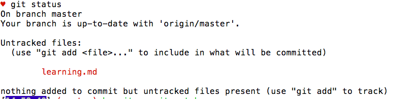

##Putting Code Online

So you do a lab, and then you spill water all over your laptop and fry it. It's the modern day version of "my dog ate my homework". Good thing the tech industry has thought of that. 

So far, we've been using Github just to take labs from the cloud and bring them down to our ocmputers to work on them, but the real power of github comes in the form of version control and hosting your code in the cloud. Version control means the ability to save snapshots of your work over time so that you can go back to different snapshots if you mess something up down the line. We can push these snapshots (called commits) to github so that they can be accessed from anywhere, allowing for collaboration with other developers.

###What is GIT?

First of all, it’s important to note that git and github aren’t the same thing. Github is where we save our code in the cloud, while git is a version control system that lives on your computer. You use git from the command line, like when you cloned a lab to your computer using `git clone`

###Git with Github
We use the Git in order to host our code on Github.

Let's say you work on a lab, and get half of the tests passing, but then you have to go home for the day. But there's a risk you could drop your laptop in the Hudson river on the way home and you'd lose all your work. So besides emailing it to yourself, which is incredibly tedious, how could you easily save your code?

The best way to save your work it to put it on Github in a repository. So how do we get it there?

Go ahead and fork this repository. (Head to the top of this page, click the fork icon, fork this lab in Github and then clone it down).
Once you're inside the directory of this lesson, go ahead and make a new file called `learning.md`. In the file, type "Hello world!" save the your changes.

Now, in terminal in the directory of this lesson, enter `git status`. You should see something like this:

Git is telling us that we have added a file to our directory, but it also says our changes haven't been tracked yet. Git is smart enough to know we've added a file, but this file and the contents of the file aren't yet set to head up to the cloud.

We have to individually add files to Git by entering in terminal `git add name_of_file`. In this case, we'd type `git add learning.md`.